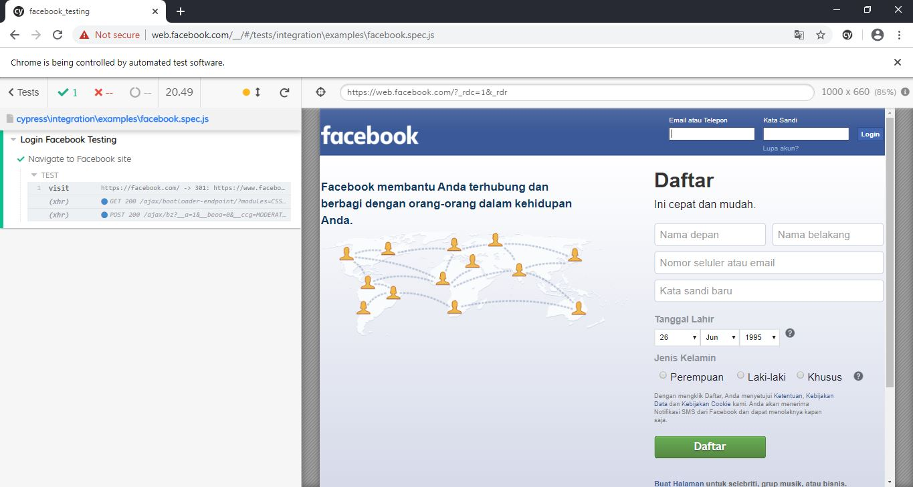
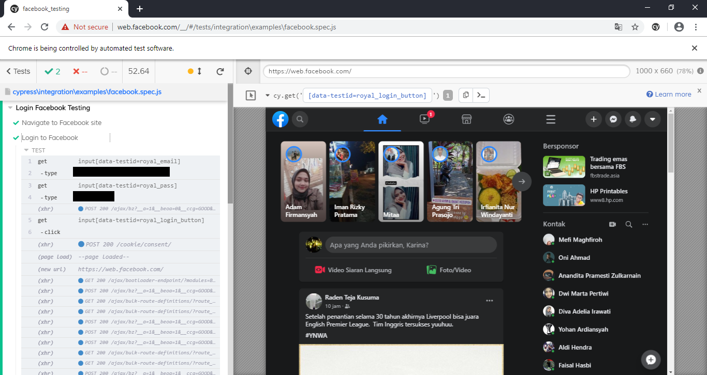

# Facebook Testing
## Cara Menjalankan
* Clone repo ini
* Buka file facebook.spec.js di cypress/integration/examples/facebook.spec.js
* Masukkan email dan password facebook anda
* Open terminal
* Open Cypress Test Runner dengan command './node_modules/.bin/cypress open --browser chrome'
* Lalu klik 'facebook.spec.js'

## Hasilnya Sebagai Berikut
* Berhasil mengakses halaman facebook dengan response code 200

* Berhasil login ke facebook

